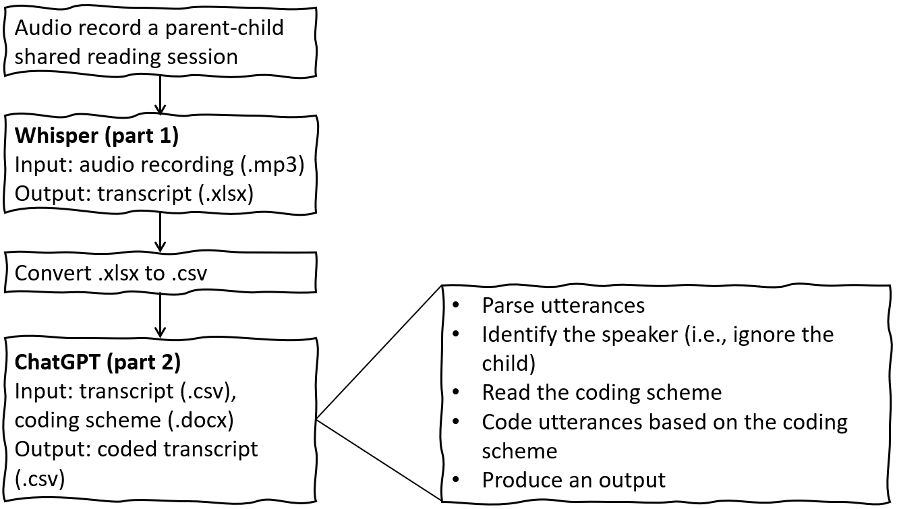

# Automatic coding of parents' shared reading practice
- [background](#background)
- [prerequisite](#prerequisite)
- [usage](#usage)

---

## Background
- Shared reading is coded using the PEER coding scheme
  - Prompt: Ask questions using CROWD (completion, recall, open-end, wh, distancing)
  - Evaluate: Praise or correct a child's utterance
  - Expand: Elaborate on a child's utterance
  - Repeat: Request a child to say the correct answer
- Flowchart of the AI's task  
  
---
## Prerequisite
1. Transcribe an audio recording into an excel file (see the code [here](./transcribe-audio/audio2xlsx.ipynb)).
2. Convert the excel transcript into a csv file (must be saved with utf 8 encoding).
3. See a sample csv transcript [here](./x33.csv).
4. Download the [PEER coding scheme](./peer_full.docx).
5. List the csv transcripts in an excel file named as "main.xlsx" (see a sample [here](./main.xlsx)).
6. Get a unique API key. Create a .env file and store the key: `GEMINI_API_KEY = the-API-key` or `OPENAI_API_KEY = the-API-key`
---
## Usage
1. Download and save the [main script](./drei.py), [function script](./drei_func.py), [prompt script](./drei_prompt.py), and [requirements list](./requirements.txt) in a folder.
2. Open an editor and type the following:
```python
python -m venv venv ##create a virtual environment (only for the first time)
.\venv\Scripts\activate ##activate venv
pip install -r requirements.txt ##install external modules that are required (only for the first time)
python .\drei.py main.xlsx ##run the main script, which will extract the csv transcripts from the excel file.
```
3. Once the script is run, it will prompt for the following:
   - **Question 1**: Are we using (G)emini or (O)penAI? **Possible input**: `g` or `o`
   - **Question 2**: Which model are we using? **Example input**: `gemini-2.0-flash` or `gpt-4o-mini`
   - **Question 3**: Are we using a(n) (U)nguided, (D)efined, or (F)ull prompt? **Possible input**: `u` or `d` or `f` (Any other response will be treated as calling for an unguided prompt.)
>[!Tip]
>- For **Question 2**, any model supported by the LLM's API should work. Check for other [OpenAI models](https://platform.openai.com/docs/models) or [Gemini models](https://ai.google.dev/gemini-api/docs/models).  
>- For **Question 3**, *unguided* means that the PEER criteria are not defined or explained in the prompt; *defined* means that simple definitions (and examples) are provided for each of the PEER criteria in the prompt; while *full* means that the entire PEER coding scheme document (originally written to guide human coders) is attached in the prompt.
